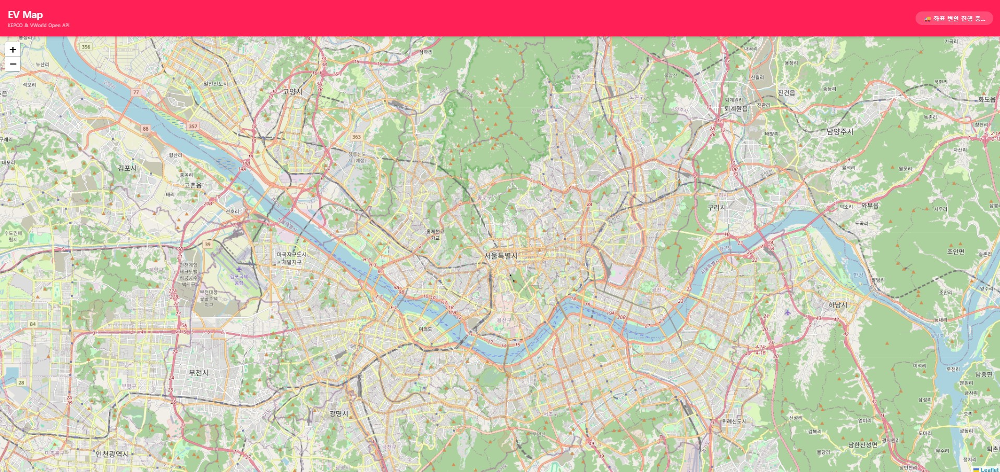

# EV map - 내 주변 전기차 충전소 찾기

공공데이터 포털(한전 API)와 브이월드(Vworld) API를 연동해 서울 시내 전기차 충전소 위치를 지도에 시각화하는 React 프로젝트입니다.

### [Tech Stack]
React, TypeScript, Vite, Leaflet, Tailwind CSS, REST API

### [Key Features]
* **실시간 충전소 데이터 로드**: 한국전력공사의 Open API를 통해 서울시 충전소 정보를 가져옵니다.
* **주소 기반 좌표 변환**: 주소 문자열을 브이월드 Geocoder API를 사용하여 위/경도 좌표로 정밀 변환합니다.
* **마커 클러스터링**: 충전소가 밀집된 지역을 클러스터로 묶어 지도의 가독성을 높였습니다. (Leaflet.markercluster 활용)
* **상세 정보 팝업**: 마커 클릭 시 충전소 명칭, 상세 주소, 급속/완속 충전기 대수를 확인할 수 있습니다.

### [Project Structure]
```
ev-charger-map/
├── public/
├── src/
│   ├── assets/             # 이미지, 아이콘 등 정적 자원
│   ├── App.jsx             # 메인 앱 컴포넌트 (라우팅 및 전체 레이아웃)
│   ├── App.css             # 앱 전체 스타일링
│   └── main.jsx            # React 엔트리 포인트 (ReactDOM 렌더링)
├── .gitignore
├── package.json
├── vite.config.js
└── README.md

```

### [Preview]



### [Issue]
현재 프로젝트는 개발 진행 중이며, API 연동 과정에서 발생한 기술적 문제들을 해결해 나가는 단계입니다.
* CORS 및 API 프록시 이슈
  - 문제 : 브라우저에서 한전 및 브이월드 API를 직접 호출 했을 때 보안 정책으로 인해 데이터 접근이 차단됨.
  - 해결 : vite.config.ts의 proxy 설정을 통해 클라이언트 요청을 서버 측에서 전달하는 방식으로 우회하여 해결.
* 주소 좌표 변환 실패 (해결 중)
  - 문제 : 한전 데이터의 주소 형식이 다양하여 브이월드 API에서 404 에러가 자주 발생함.
  - 해결 과정 : road(도로명)과 parcel(지번)을 순차적으로 호출하도록 로직 개선 단계
